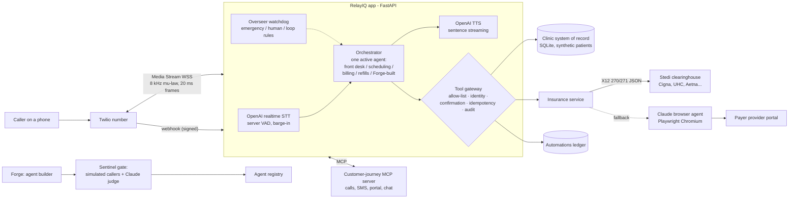

# RelayIQ v3 — voice-first agentic patient access

**A real phone line for a medical clinic where Claude agents verify the caller, check insurance eligibility with the payer, and book the visit end to end — [FILL] ms median turn latency, [FILL]/7 release-gate scenarios passing, [FILL] staff minutes automated in the demo run.**

## Result

| Metric | Value |
|---|---|
| Turn latency, caller stops → first agent audio (p50 / p95) | [FILL] ms / [FILL] ms |
| Overseer release gate (7 baseline scenarios, Claude-graded) | [FILL]/7 passed, mean [FILL]/5 |
| Insurance check via clearinghouse API (Stedi test mode) | [FILL] ms |
| Payer-portal fallback (browser agent) | [FILL] s, [FILL] steps |
| Policy blocks in demo (writes without ID / confirmation) | [FILL] |

[FILL: dashboard screenshot during a live call — live transcript, ledger, insurance check, gate results]

Everything runs on real services: Twilio Programmable Voice + Media Streams, OpenAI `gpt-4o-transcribe` (streaming STT) and `gpt-4o-mini-tts`, Claude Haiku 4.5 for the voice agents, Claude Sonnet 5.5 for Forge, grading and the browser agent, and an OpenAI GPT-5.4 mini model as the simulated caller. Test doubles exist only under `tests/`.

## Architecture



A call: Twilio streams caller audio → OpenAI transcribes with server VAD (end of turn, barge-in) → the active Claude agent streams a reply, calling tools only through the gateway → each sentence is synthesized as soon as it completes and streamed back to Twilio with marks, so we know exactly what the caller heard if they interrupt.

## Design decisions

1. **Chained STT → Claude → TTS instead of a speech-to-speech model.** Every stage is observable (per-stage latency in `turns`), the reasoning model is swappable, and tool calls go through one audited gateway. Given up: roughly 300–600 ms versus an end-to-end realtime model (estimate), and some prosody. Sentence-level TTS streaming, cached fillers ("Let me verify that with your insurance plan") and a 550 ms VAD window claw most of it back.
2. **One active agent with handoffs, not a supervisor relaying every turn.** The specialist talks to the caller directly, so a turn costs one LLM round trip; tool scope is enforced per agent. Shared context travels as a "case file" of tool-established facts rather than raw tool transcripts. Given up: a central planner that could coordinate multi-specialist tasks in one turn.
3. **Clearinghouse API first, payer-portal browser agent second.** The 270/271 API answers in seconds and is how production revenue-cycle systems check eligibility; the browser agent covers payers or plans the API can't answer, runs asynchronously (book as "pending insurance", text the patient when confirmed) and is off until you have portal credentials and permission to automate. Given up: an instant answer on every call — the portal path takes about a minute.

## What did not work

- **The first v3 never completed a real voice call.** It was a scaffold tested against an offline fake model. This rebuild started from the audio path: bit-exact G.711 codec, Twilio Media Streams protocol (start / media / mark / clear / stop) and barge-in are covered by protocol tests and an end-to-end smoke caller that behaves exactly like Twilio against real models.
- **Newer Claude models reject parameters older ones accept.** Claude Sonnet 5.5 refuses non-default `temperature` and forced `tool_choice`, so the grader and Forge would have errored on their first real call. The model factory now omits those for adaptive-thinking models and uses JSON-schema structured output.
- **The browser agent leaked a portal password to the model.** A test portal that submits its login form with GET echoed the password back in the URL, and the page snapshot carried it to the LLM. Snapshots and tool results are now scrubbed of every configured secret (raw and URL-encoded, plus live TOTP codes).
- [FILL: what broke on the first real phone call and how it was fixed]

## Why this matters for the business

Front-desk phones are where clinics lose patients and money: callers on hold hang up, and visits booked without an eligibility check turn into denied claims and surprise bills. RelayIQ answers every call, books the visit only after confirming coverage with the payer, and leaves an audit trail of every action — the ledger turns that into staff minutes saved. The guardrails are what make it deployable in healthcare: no PHI before identity verification, no change without a spoken yes, deterministic emergency handling, and a release gate so a new agent (built in minutes with Forge) can't go live until simulated callers and a grader say it's safe.

---

## Run it

Needs: Python 3.11–3.13, [uv](https://docs.astral.sh/uv/), a Twilio number (upgraded account — trial accounts play a notice and only call verified numbers), Anthropic and OpenAI API keys, and `cloudflared` (or ngrok) for a public HTTPS URL. A Stedi test API key is optional.

```bash
make install                     # deps + Chromium for the portal agent
cp .env.example .env             # fill keys, Twilio number, ADMIN_PHONE (your cell, for Forge)
make test                        # protocol + policy tests, no API spend
make dev                         # MCP journey server :8765 + voice app :8000
make tunnel                      # in another terminal; copy the https URL into PUBLIC_BASE_URL, restart make dev
make twilio DEMO_CALLER=+1214... # point the number here; your cell becomes "John Doe" for caller ID
make smoke                       # real end-to-end call without a phone; saves data/smoke_call.wav
# now call your Twilio number. Dashboard: http://localhost:8000
make evals                       # Overseer release gate with real models
```

Demo patients (synthetic): John Doe, DOB April 12 1980 (UHC) · Jordan Smith, Sept 30 1992 (Cigna) · Ana Lopez, Jan 22 1975 (Aetna). For a real Stedi test-mode check, copy one of Stedi's published mock eligibility requests onto a patient with `scripts/check_eligibility.py` (see its docstring). Until a clearinghouse key is set, insurance comes back "unverified" and the booking is marked pending — never invented.

The demo walkthrough for the interview is in [`docs/DEMO.md`](docs/DEMO.md).

## Repo layout

| Path | What it is |
|---|---|
| `src/relayiq/voice/` | Twilio Media Streams session, OpenAI realtime STT, streaming TTS, G.711 codec, sentence chunker, Twilio REST (SMS, transfer) |
| `src/relayiq/agents/` | Orchestrator (handoffs, streaming), agent registry, prompts and platform guardrails, model factory |
| `src/relayiq/gateway/` | Tool gateway (policy chokepoint + ledger) and clinic tools |
| `src/relayiq/insurance/` | Stedi eligibility client + parser, Claude/Playwright payer-portal agent, verification service |
| `src/relayiq/context/` | Customer-journey MCP server and client |
| `src/relayiq/forge/` | Agent builder (draft → validate → gate → register) |
| `src/relayiq/overseer/` | Watchdog, AI-to-AI simulator, grader, Sentinel release gate, baseline scenarios |
| `src/relayiq/dashboard/` | Live console |
| `scripts/` | Smoke caller, Twilio setup, eval runner, eligibility check |

## Compliance notes

Synthetic patients only. Before real PHI: BAAs with Anthropic, OpenAI, Twilio and the clearinghouse; HIPAA-eligible configurations (e.g. zero data retention); encrypted storage instead of SQLite; and payer portal automation only where the portal's terms allow it for your account (`PORTAL_AUTOMATION_ENABLED` is off by default).
